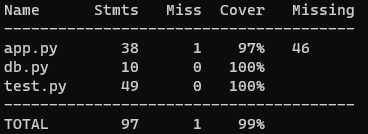

[](https://github.com/software-students-fall2023/5-final-project-happyholidays/actions/workflows/CI.yml)
[](https://github.com/software-students-fall2023/5-final-project-happyholidays/actions/workflows/CD.yml)
# Pykemon Match

## Description

Pykemon Match is a memorization matching game. At the beginning of the game, the player is presented with 8 Pokémon cards facing down. First, the player must select two cards by clicking on them with the mouse. The cards will then each reveal a Pokemon simultaneously. If the two cards match, they dissapear. If the cards do not match, they flip back over again (unlucky). To win the game, the player must remove all of the cards. A timer will track how quickly a player can match all of the cards, and there is a leaderboard where the player can enter their time and compare their ranking with other players. Pykemon Match is a fun game for players of all ages. Happy matching!

## Webpage
http://104.131.167.165:4000/

## How To Play
Click on any 2 cards to see if they match. Try to match them all as fast as you can.

## Steps to run
In root directory of the app.
```bash
docker-compose build
docker-compose up
```

## Test Coverage


## Dockerhub Link
https://hub.docker.com/r/catinthefridge/nye-ce

## Contributors

- [@AlvisYan2025](https://github.com/AlvisYan2025)
- [@Jason-SL-Zhang](https://github.com/Jason-SL-Zhang)
- [@SpencerWPak](https://github.com/SpencerWPak)
- [@HenryGreene10](https://github.com/HenryGreene10)
